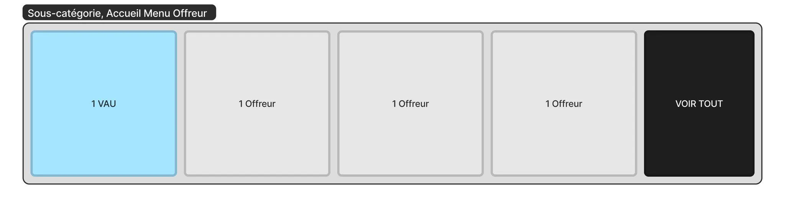
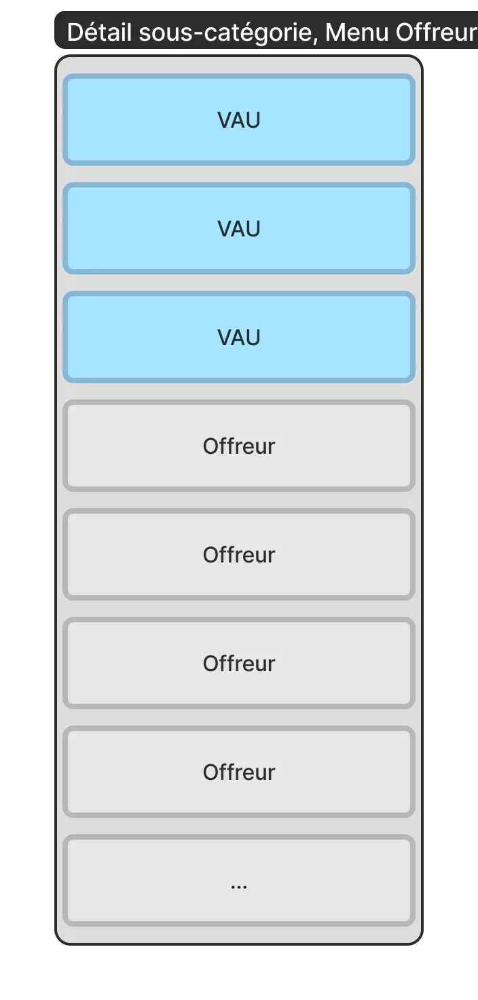
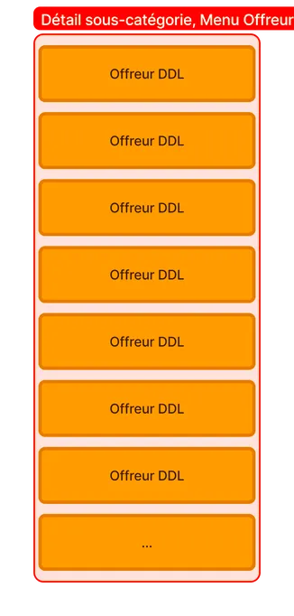

# 📕 Algorithme du Menu Offreurs

Ce document décrit l'algorithme du Menu Offreurs, qui permet de filtrer les offreurs en fonction de leur activité récente, de leur localisation et de leur taux de réponse. Il existe deux modes de filtrage : "classique" et "Dispo dans l'heure". Les résultats sont triés par date de dernière connexion et affichés sur l'accueil du menu Offreurs ou dans le détail de chaque sous-catégorie.

Le Menu Offreurs permet également d'afficher les photos de réalisation des offreurs dans un ordre défini ci-dessous. Les photos sont affichées en fonction de la sous-catégorie correspondante, de la catégorie mère, des photos renseignées sur le profil de l'utilisateur.

---

## Sommaire

- Explications Ⓒ Mehdi à mettre en forme
- Listing des Offreurs
  - Algorithme de filtre des offreurs
    - Mode classique
    - Mode Dispo dans l'heure
  - Algorithme d'affichage
    - Accueil du menu Offreur
    - Détail d'une sous-catégorie
    - Mode classique
    - Mode Dispo dans l'heure
- Affichage des photos des offreurs

---

## Explications Ⓒ Mehdi à mettre en forme

L'algo est basé sur ces paramètres principaux : une latitude, une longitude et une sous-catégorie.

On a aussi d'autres paramètres secondaires : la pagination, un tri, un filtre sur le statut pro, un mode dispo dans l'heure, un filtre sur l'affichage de vrais favorisés uniquement.

### L'algorithme du menu offreurs est utilisé à 3 endroits :

1. Une page sous-catégorie du menu offreurs
2. L'accueil du menu offreurs : même algo mais en limite à 4 cartes
3. La recommandation sur une demande publique : même algo mais uniquement sur les offreurs avec lesquels on a été en contact

---

### Étapes de l'algo :

1. On commence par calculer un rayon optimal (plus petit dans une grande ville qu'à la campagne) en augmentant le rayon de 1 en 1 (jusqu'à 20km max) jusqu'à trouver 50 offreurs
2. On exclut les utilisateurs bloqués
3. On récupère la liste des offreurs boostés à afficher (Booster actif et dont l'adresse et la catégorie correspondent). On applique les différents filtres et tris puis on les affiche en 1er. On ajoute les résultats aux compteurs
4. On récupère la liste des autres offreurs :
   - si filtre DDL activé alors on utilise un sous-algorithme particulier qui bypass le fait que l'utilisateur soit réellement offreur sur la sous-catégorie (utilisation de réponses et taux de réponse sur la sous-catégorie)
   - sinon alors on va chercher dans ElasticSearch les profils correspondants. Dans ElasticSearch on maintient à jour la liste des offreurs à chaque fois qu'il se connecte, qu'il répond à une demande, etc. On ne les ajoute sur la sous-catégorie que s'ils ont répondu dans les 12 derniers mois, s'ils ont répondu au moins 2 fois et si le taux est supérieur à 10% (taux de réponse par rapport aux autres sous-catégories : si on répond à 100 demandes de plomberie et 1 demande d'élagage = 1% en élagage = non pertinent). On ajoute les résultats aux compteurs
5. On les affiche à la suite
6. la distance affichée est entre les coordonnées précises du menu offreur et l'adresse de l'offreur
7. Le "en ligne là" est basé sur la date de dernier appel API effectuée (pas tout à fait fiable mais suffisant)

---

## Listing des Offreurs

### Algorithme de filtre des offreurs

#### Mode classique

Pour chaque sous-catégorie présentée dans le menu Offreurs, les offreurs affichés correspondent aux critères suivants :

1. doit avoir répondu au moins 2 fois à la sous-catégorie dans les 12 derniers mois
2. doit avoir son adresse dans un rayon de 30 km autour de celle du demandeur qui vient consulter le menu Offreurs
3. doit avoir au moins 10% de ses réponses sur la sous-catégorie concernée (nombre de ses réponses dans cette catégorie / nombre total de ses réponses)

> _Ajout de VU si l'adresse du demandeur qui consulte la sous-catégorie du menu Offreur est incluse dans le périmètre du VU._

#### Mode Dispo dans l'heure

1. doit avoir son adresse dans un rayon de 20 km autour de celle du demandeur qui vient consulter le menu Offreurs ou a déjà répondu sur cette sous-catégorie au moins 1 fois/60h dans un de ses périmètres VU ou Premium qui inclut la sous-catégorie et l'adresse du demandeur.

---

## Algorithme d'affichage

### Accueil du menu Offreur

Pour chaque sous-catégorie de l'accueil du menu Offreurs, on affiche :

- 1 VU choisi aléatoirement parmi l'ensemble des VU qui correspondent à l'algorithme de filtre des offreurs
- d'autres offreurs correspondant à l'algorithme de filtre des offreurs ET triés par récence de date de dernière connexion

---

### Détail d'une sous-catégorie

|  | **Mode classique**  - Pour le détail de chaque sous-catégorie du Menu Offreurs, on :  - Autant de VU qui correspondent à l'algorithme de filtre des offreurs (mode classique), triés par récence de date de dernière connexion  - Autant d'autres offreurs qui correspondent à l'algorithme de filtre des offreurs, triés également par récence de date de dernière connexion |
| :-------------------------------------------------------------------: | :---------------------------------------------------------------------------------------------------------------------------------------------------------------------------------------------------------------------------------------------------------------------------------------------------------------------------------------------------------------------------------------- |

#### Mode Dispo dans l'heure

|  | **Mode Dispo dans l'heure**  - Pour le détail de chaque sous-catégorie du Menu Offreurs, en mode Dispo dans l'heure, on affiche :  - Autant d'offreurs DDL correspondant à l'algorithme de filtres des offreurs (mode DDL), triés par récence de la date de dernière connexion |
| :--------------------------------------------------------: | :-------------------------------------------------------------------------------------------------------------------------------------------------------------------------------------------------------------------------------------------------------------------------------------- |

---

## Affichage des photos des offreurs

> ℹ️ Cette règle s'applique à toutes les cartes offreurs dans le produit

Les photos de réalisation de l'offreur sont affichées selon cet ordre de priorité :

1. Photos de la sous-catégorie correspondantes (version actuelle)
2. Photos de la catégorie mère correspondantes
3. Toutes les photos que l'utilisateur a renseigné sur son profil (même si ça ne correspond pas à la sous-catégorie recherchée)
4. Photo vide par défaut (si les 3 cas ci-dessus échouent)
