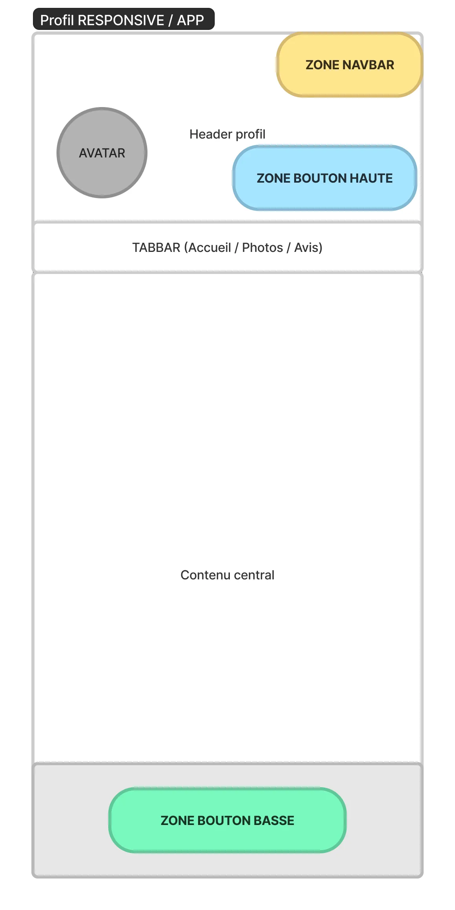

# 📕 Affichage des CTAs du Profil connecté

Ce document décrit les règles d’affichage des CTAs (call-to-action) sur les profils connectés. Les CTAs diffèrent en fonction de la manière dont le profil est consulté, par exemple depuis une carte du menu Offreurs ou depuis une suggestion de favoris. Les CTAs incluent des options telles que "Partager", "Téléphoner", "Favori" et "Poster une demande".

---

## Sommaire

1. Règle 1 : Affichage des CTAs
   1. Je consulte le profil d'un Offreur depuis une carte du Menu Offreurs
   2. Je consulte le profil d'un Offreur (je suis certain qu'il s'agit d'un Offreur) depuis ailleurs dans le produit
   3. Je consulte un profil depuis ailleurs dans le produit, qui est un profil demandeur OU dont je ne suis pas sûr
   4. Je consulte MON profil, depuis le menu Mon Compte

---

## REGLE 1 : Affichage des CTAs

|  |  |
| :-----------------------------------------------------: | :---------------------------------------------------------: |

---

### 1 - Je consulte le profil d'un Offreur depuis une carte du Menu Offreurs

| Zone               | Liste CTA                                                | Apparence                                                                  |
| ------------------ | -------------------------------------------------------- | -------------------------------------------------------------------------- |
| Zone Bouton Haute  | - Téléphoner (si actif)                                  | - Couleur : selon statut du profil (neutral/violet)   - Type : Outlined |
| Zone TabBar/NavBar | - Partager   - Menu Kebab : Signaler un abus, Bloquer | X                                                                          |
| Zone Bouton Basse  | - Favori   - Ajouter                                  | - Couleur : neutral, tout le temps   - Type : Contained                 |

---

### 2 - Je consulte le profil d'un Offreur (je suis certain qu'il s'agit d'un Offreur) depuis ailleurs dans le produit

| Zone               | Liste CTA                                                | Apparence                                                                  |
| ------------------ | -------------------------------------------------------- | -------------------------------------------------------------------------- |
| Zone Bouton Haute  | - Partager   - Téléphoner (si actif)                  | - Couleur : selon statut du profil (neutral/violet)   - Type : Outlined |
| Zone TabBar/NavBar | - Partager   - Menu Kebab : Signaler un abus, Bloquer | X                                                                          |
| Zone Bouton Basse  | - Favori   - Poster une demande (manuelle)            | - Couleur : selon statut du profil   - Type : Contained                 |

---

### Règles des CTA sur le profil d'un Offreur :

| Menu Offreur | Cartes Offreurs : Favoris - Ajouter   Profil menu Offreur : Favoris - Ajouter   Favori menu Offreur : Favori - Poster une demande                                          |
| ------------ | -------------------------------------------------------------------------------------------------------------------------------------------------------------------------------- |
| NewsFeed     | - Clic sur un profil Offreur (issus des réponses) : Favori - Poster une demande   - Suggestions de favoris : Poster une demande                                               |
| Messagerie   | - Clic sur profil depuis une conversation : Pas de CTA                                                                                                                           |
| Mails        | - Flux hebdo :   _ Clic sur "voir la demande" puis sur le profil du demandeur : Pas de CTA   _ Ajout en favori : Pas de CTA   \* Clic sur "voir le profil" : Pas de CTA |

---

### 3 - Je consulte un profil depuis ailleurs dans le produit, qui est un profil demandeur OU dont je ne suis pas sûr que c'est un Offreur

| Zone               | Liste CTA                                                                  | Apparence |
| ------------------ | -------------------------------------------------------------------------- | --------- |
| Zone Bouton Haute  | - Couleur : selon statut du profil (neutral/violet)   - Type : Outlined |
| Zone TabBar/NavBar | - Partager   - Menu Kebab : Signaler un abus, Bloquer                   | X         |
| Zone Bouton Basse  | (zone masquée)                                                             | X         |

---

### 4 - Je consulte MON profil, depuis le menu Mon Compte

| Zone               | Liste CTA                                  | Apparence                                  |
| ------------------ | ------------------------------------------ | ------------------------------------------ |
| Zone Bouton Haute  | Partager                                   | - Couleur : neutral   - Type : Outlined |
| Zone TabBar/NavBar | 1. Partager   2. Compléter profil (app) | X                                          |
| Zone Bouton Basse  | Compléter mon profil                       | X                                          |
